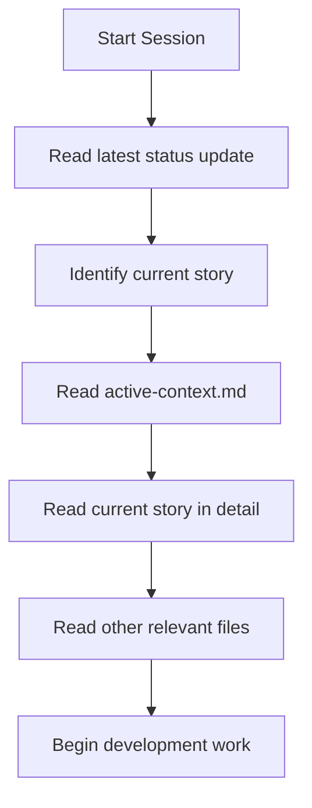
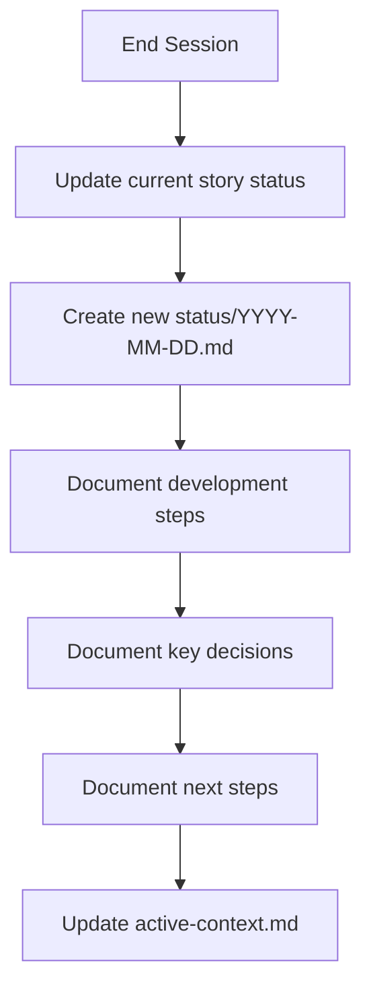

# Kleiderzauber AI Memory & Workflow

This directory contains project documentation, memory, and workflow artifacts for the Kleiderzauber project.

## Structure

```
.ai/
├── project/                # Core project documentation
│   ├── 01-prd.md          # Project Requirements Document (Approved)
│   ├── 02-arch.md         # Architecture documentation (Approved)
│   ├── 03-structure.md    # Project structure documentation
│   └── 04-deployment.md   # Deployment configuration (Draft)
├── stories/               # Central development focus
│   ├── story-1-user-registration-login.story.md
│   └── current-story.md   # Reference to active story
├── status/                # Session management
│   ├── 2025-03-21.md      # Daily status update
│   └── active-context.md  # Current task and decisions
├── artifacts/             # Project artifacts
│   ├── diagrams/         # Visual representations
│   ├── specs/            # Detailed specifications
│   └── tests/            # Test strategies
└── README.md             # This file
```

## Purpose

This directory serves as a comprehensive memory bank and workflow documentation for the Kleiderzauber project. It follows a structured approach to maintain project knowledge, facilitate collaboration, and ensure consistent implementation according to defined patterns and requirements.

## Key Documents

- **Project/01-prd.md**: Defines the project scope, features, and requirements
- **Project/02-arch.md**: Outlines the technical architecture and patterns
- **Project/03-structure.md**: Documents the file and folder organization
- **Stories**: Contains detailed user stories with tasks and requirements
- **Status/active-context.md**: Describes the current work focus and priorities
- **Status/YYYY-MM-DD.md**: Daily status updates tracking progress

## Workflow

1. Start each session with `start-session` to review latest status
2. Check the Active Context to see current focus
3. Follow TDD approach for all implementation work:
   - Write tests first
   - Implement features
   - Ensure tests pass
4. End each session with `end-session` to document progress

## Session Management

### Start Session Process



### End Session Process



## Status

The project has completed the documentation phase with approved PRD and Architecture documents. Next steps are to set up the project structure and begin implementation of the first story focusing on user authentication.
