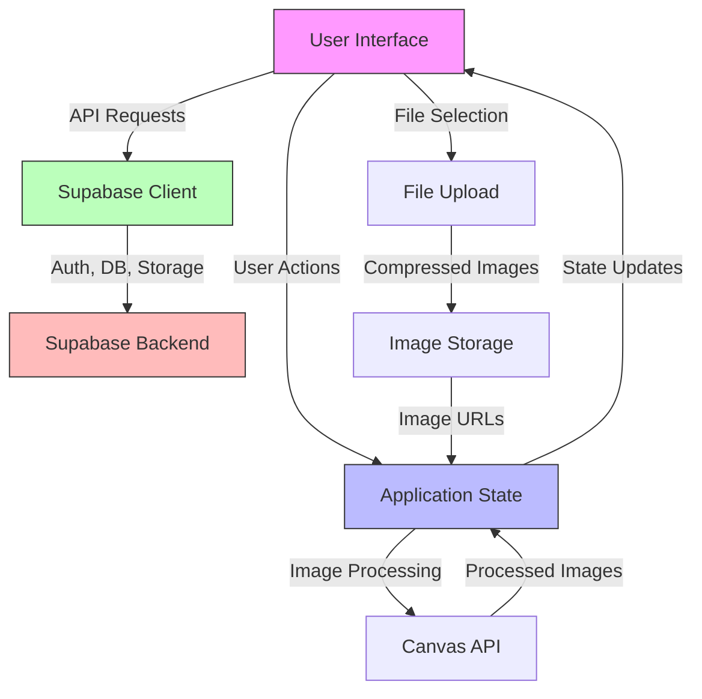
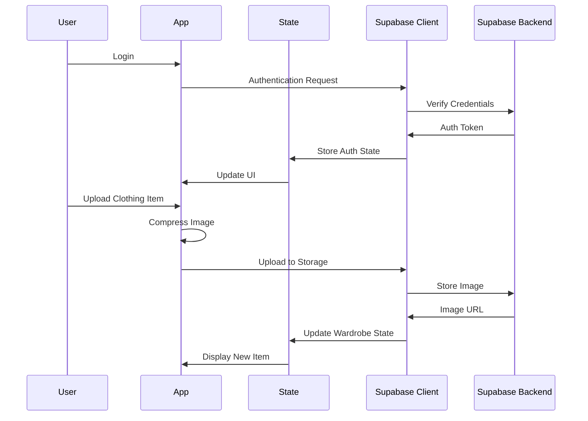

# Architecture for Kleiderzauber

## Status: Approved

## Technical Summary

Kleiderzauber is a virtual wardrobe application built with a modern web stack. The architecture focuses on a responsive single-page application that provides a seamless user experience across devices. The system employs React for the frontend, Supabase for backend services, and utilizes modern web APIs for image handling. The application follows a component-based architecture with clear separation of concerns between UI components, data management, and business logic.

## Technology Table

| Technology                | Description                                                           |
| ------------------------- | --------------------------------------------------------------------- |
| TypeScript                | Strongly-typed programming language for enhanced developer experience |
| React                     | Frontend UI library for building interactive user interfaces          |
| Tailwind CSS              | Utility-first CSS framework for styling                               |
| Zustand                   | Lightweight state management library                                  |
| Supabase                  | Backend-as-a-Service for authentication, database, and storage        |
| Vite                      | Next-generation frontend build tool                                   |
| React Router              | Library for routing and navigation                                    |
| Canvas API                | For image manipulation and outfit composition                         |
| React Dropzone            | For file upload handling                                              |
| browser-image-compression | For client-side image optimization                                    |
| React Hot Toast           | For user notifications                                                |

## Architectural Diagrams





## Data Models

### User Schema

```typescript
interface User {
  id: string;
  email: string;
  full_name?: string;
  avatar_url?: string;
  preferences: {
    theme: "light" | "dark" | "system";
    units: "metric" | "imperial";
    language: string;
  };
  created_at: string;
  updated_at: string;
}
```

### Clothing Item Schema

```typescript
interface ClothingItem {
  id: string;
  user_id: string;
  name: string;
  description?: string;
  category:
    | "tops"
    | "bottoms"
    | "outerwear"
    | "footwear"
    | "accessories"
    | "other";
  sub_category?: string;
  color: string[];
  season: ("spring" | "summer" | "fall" | "winter")[];
  occasion: string[];
  brand?: string;
  size?: string;
  image_url: string;
  thumbnail_url: string;
  created_at: string;
  updated_at: string;
  last_worn?: string;
  favorite: boolean;
}
```

### Outfit Schema

```typescript
interface Outfit {
  id: string;
  user_id: string;
  name: string;
  description?: string;
  items: string[]; // Array of clothing item IDs
  occasion: string[];
  season: ("spring" | "summer" | "fall" | "winter")[];
  weather: string[];
  image_url?: string;
  created_at: string;
  updated_at: string;
  last_worn?: string;
  favorite: boolean;
  planned_date?: string;
}
```

## Project Structure

```
/
├── /public              # Static assets
├── /src
│   ├── /api            # API client functions
│   ├── /assets         # Project assets (icons, images)
│   ├── /components     # Reusable UI components
│   │   ├── /auth       # Authentication components
│   │   ├── /closet     # Virtual closet components
│   │   ├── /outfit     # Outfit creation components
│   │   ├── /profile    # User profile components
│   │   └── /ui         # Common UI components
│   ├── /hooks          # Custom React hooks
│   ├── /layouts        # Page layout components
│   ├── /pages          # Page components
│   ├── /stores         # Zustand stores
│   ├── /types          # TypeScript type definitions
│   ├── /utils          # Utility functions
│   ├── App.tsx         # Main App component
│   ├── main.tsx        # Application entry point
│   └── supabase.ts     # Supabase client configuration
├── /supabase           # Supabase migrations and types
├── index.html          # HTML entry point
├── package.json        # Project dependencies
├── tailwind.config.js  # Tailwind configuration
├── tsconfig.json       # TypeScript configuration
└── vite.config.ts      # Vite configuration
```

## Change Log

| Change                | Story ID | Description                                       |
| --------------------- | -------- | ------------------------------------------------- |
| Initial Architecture  | N/A      | Initial system design and documentation           |
| Architecture Approval | N/A      | Architecture document approved for implementation |
