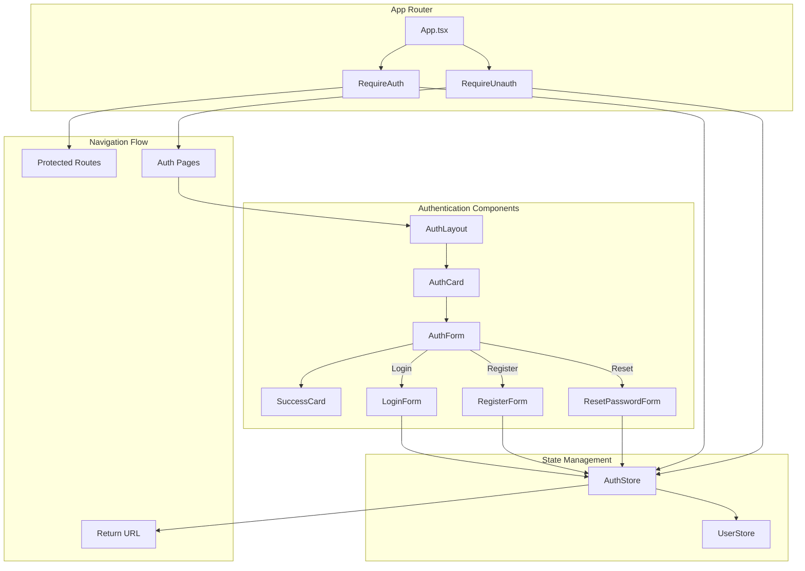

# Status Update: 2025-03-21

## Development Steps

[Timestamp: 14:30]

1. Reorganized Styles Directory Structure
   - Created new styles directory with proper organization
   - Implemented variables, mixins, and global styles
   - Added comprehensive documentation
   - Files affected:
     - `src/styles/variables/colors.css`
     - `src/styles/variables/layout.css`
     - `src/styles/variables/typography.css`
     - `src/styles/mixins/utils.css`
     - `src/styles/mixins/animations.css`
     - `src/styles/global/base.css`
     - `src/styles/index.css`

[Timestamp: 15:00] 2. Enhanced Theme Implementation

- Implemented robust theme switching functionality
- Added system theme detection
- Created theme provider and switcher components
- Files affected:
  - `src/components/theme/theme-provider.tsx`
  - `src/components/theme/theme-switcher.tsx`
  - `src/components/theme/index.ts`
  - `src/components/layout/navbar.tsx`

## Key Decisions

1. CSS Organization:

   - Separated variables by concern (colors, layout, typography)
   - Created utility mixins for common patterns
   - Added animation utilities for consistent transitions
   - Implemented proper dark mode structure

2. Theme Implementation:
   - Used React Context for theme state management
   - Implemented system theme preference detection
   - Added persistent theme storage
   - Created smooth theme transitions

## Next Steps

1. Continue Story-4: Project Structure Refactoring

   - [ ] Complete documentation of CSS architecture
   - [ ] Add CSS best practices guidelines
   - [ ] Implement feature-based structure
   - [ ] Create shared utilities directory
   - [ ] Document directory structure standards

2. Testing & Validation
   - [ ] Test theme switching in all components
   - [ ] Verify responsive design
   - [ ] Check accessibility compliance
   - [ ] Validate CSS organization

## Story References

- Current Story: [Story-4: Project Structure Refactoring](../stories/story-4-project-structure-refactoring.story.md)
- Next Tasks: Directory structure optimization and documentation

## Technical Notes

1. CSS Architecture:

```
src/styles/
├── global/        # Global styles
├── variables/     # CSS variables
├── mixins/        # Reusable patterns
└── index.css      # Main entry
```

2. Theme Implementation:

```typescript
type Theme = "light" | "dark" | "system";
```

3. Key Features Added:
   - System theme detection
   - Persistent theme storage
   - Smooth transitions
   - Accessibility support

## Challenges & Solutions

1. Challenge: CSS Organization

   - Solution: Implemented clear separation of concerns
   - Result: More maintainable and scalable styles

2. Challenge: Theme Switching
   - Solution: Used React Context and localStorage
   - Result: Seamless theme transitions with persistence

## Documentation Updates

1. Added README files:

   - `src/styles/README.md`: CSS architecture documentation
   - Component documentation in theme files

2. Updated existing documentation:
   - CSS variables documentation
   - Theme switching implementation
   - Best practices guidelines

## Development Steps

[Timestamp: 03:42]

1. Analyzed current project structure:

   - Identified traditional React layout with separate directories
   - Evaluated needs for feature-based reorganization
   - Mapped dependencies and relationships

2. Created knowledge graph for tracking:
   - Documented current structure state
   - Mapped Story-4 requirements
   - Defined feature-based structure goals

[Timestamp: 03:55] 3. Implemented initial feature-based structure:

- Created features/ directory with auth, profile, wardrobe, and theme modules
- Set up shared/ directory for common components and utilities
- Created feature module type definitions and utilities
- Implemented auth feature module as example

[Timestamp: 04:05] 4. Migrated auth components to feature module:

- Moved login-form, register-form, and reset-password-form components
- Relocated ProtectedRoute component
- Created proper component exports
- Cleaned up old auth directory

[Timestamp: 04:15] 5. Migrated profile components to feature module:

- Moved Avatar and ProfileForm components
- Created profile-specific type definitions
- Set up profile feature module structure
- Cleaned up old profile directory

[Timestamp: 04:25] 6. Migrated wardrobe components to feature module:

- Moved ItemCard and UploadZone components
- Created comprehensive wardrobe type system
- Set up wardrobe feature module structure
- Cleaned up old wardrobe directory

[Timestamp: 04:35] 7. Migrated theme components to feature module:

- Moved ThemeProvider and ThemeToggle components
- Created theme-specific type system
- Set up theme feature module structure
- Cleaned up old theme directory

[Timestamp: 04:45] 8. Updated import paths across the codebase:

- Moved Layout to shared components
- Updated App.tsx imports to use feature modules
- Updated page component imports
- Ensured consistent import patterns

[Timestamp: 04:55] 9. Implemented path aliases for cleaner imports:

- Updated TypeScript configuration with path mappings
- Updated Vite configuration with matching aliases
- Refactored imports in App.tsx and pages
- Created consistent import patterns

[Timestamp: 05:05] 10. Fixed TypeScript module resolution: - Updated Vite config with wildcard patterns - Synchronized tsconfig.app.json path mappings - Created shared types directory - Implemented proper type exports

## Key Decisions

[Timestamp: 03:42]

- Will implement feature-based structure while maintaining utility directories
- Will create features/ directory for feature modules
- Will keep shared components separate from feature-specific ones
- Will maintain current utility directory structure (hooks/, utils/, types/)

[Timestamp: 03:55]

- Created FeatureModule interface for standardized module structure
- Implemented feature registration and configuration utilities
- Chose to keep shared utilities separate from feature-specific code
- Decided to use barrel files (index.ts) for clean exports

[Timestamp: 04:05]

- Moved auth components to maintain feature isolation
- Using component subdirectories for complex features
- Keeping flat structure for simple components
- Implementing consistent export patterns

[Timestamp: 04:15]

- Implemented consistent type sharing between features (auth types in profile)
- Using Pick utility type for type composition
- Maintaining clear separation of user data and preferences

[Timestamp: 04:25]

- Created detailed type system for wardrobe items and filters
- Using discriminated unions for seasons
- Implementing prop interfaces for components
- Maintaining consistent naming conventions

[Timestamp: 04:35]

- Created comprehensive theme type system
- Using discriminated unions for theme values
- Implementing React context pattern consistently
- Maintaining type safety in theme context

[Timestamp: 04:45]

- Moved Layout to shared components for reusability
- Using feature-based imports consistently
- Maintaining clean import paths
- Using barrel files for simplified imports

[Timestamp: 04:55]

- Created comprehensive path alias system
- Using @features, @shared, @utils, etc. for clear imports
- Maintaining consistent import patterns across codebase
- Simplified relative path complexity

[Timestamp: 05:05]

- Added wildcard patterns to Vite config for better path resolution
- Synchronized path mappings across all config files
- Centralized shared types in types directory
- Using consistent type export patterns

## Next Steps

[Last Updated: 05:05]

1. Document new import standards
2. Create migration guide for existing code
3. Review and test all component imports
4. Set up ESLint rules for import patterns

## Technical Debt Identified

- Need for consistent export pattern enforcement
- Potential for similar import/export mismatches in other components
- CSS configuration could benefit from better documentation
- Project structure needs optimization for scalability
- Need to implement proper feature registration logic
- Feature configuration system needs to be built

## Migration Progress

- ✅ Auth Feature Module

  - ✅ Component Migration
  - ✅ Type Definitions
  - ✅ Feature Registration
  - ✅ Clean-up

- ✅ Profile Feature Module

  - ✅ Component Migration
  - ✅ Type Definitions
  - ✅ Feature Registration
  - ✅ Clean-up

- ✅ Wardrobe Feature Module

  - ✅ Component Migration
  - ✅ Type Definitions
  - ✅ Feature Registration
  - ✅ Clean-up

- ✅ Theme Feature Module

  - ✅ Component Migration
  - ✅ Type Definitions
  - ✅ Feature Registration
  - ✅ Clean-up

## Import Path Updates

- ✅ App.tsx

  - Updated ThemeProvider import
  - Updated ProtectedRoute import
  - Moved Layout to shared components

- ✅ Pages

  - Updated Auth.tsx imports
  - Updated Profile.tsx imports
  - Updated Wardrobe.tsx imports

- ✅ Features
  - Using consistent barrel file exports
  - Clean import paths from feature roots
  - Type exports properly configured

## Path Alias Implementation

- ✅ Configuration

  - Added TypeScript path mappings
  - Updated Vite alias configuration
  - Ensured consistent alias patterns
  - Added wildcard patterns for better resolution

- ✅ Import Updates

  - Updated App.tsx imports
  - Updated Auth page imports
  - Updated Profile page imports
  - Updated Wardrobe page imports

- ✅ TypeScript Resolution
  - Fixed module resolution errors
  - Verified type imports work correctly
  - Ensured consistent type usage
  - Centralized shared types

## Build/Deploy Impact

- Fixed critical runtime errors preventing application startup
- Improved CSS loading reliability
- Cleaned up build configuration
- Enhanced development workflow with standardized patterns
- New feature-based structure will improve code organization and maintainability

## Story References

- Current Story: [Story-4: Project Structure Refactoring](./../stories/story-4-project-structure-refactoring.story.md)

## Recent Updates

### TypeScript Module Resolution (10:30 AM)

- Fixed TypeScript module resolution by updating Vite config
- Synchronized path mappings across all config files
- Created shared types directory and implemented proper type exports
- Added wildcard patterns to Vite config for better module resolution

### Import Standards Documentation (11:15 AM)

- Created comprehensive import standards documentation
- Defined path alias usage and guidelines
- Established barrel file conventions
- Added migration guide for existing code

### ESLint Configuration (12:00 PM)

- Installed eslint-plugin-import for import pattern enforcement
- Configured ESLint rules to enforce:
  - Path alias usage over relative imports
  - Barrel file imports for features and shared components
  - Type imports consistency
  - Import ordering and grouping
- Added custom error messages for import violations

### Project Structure Cleanup (1:00 PM)

- Removed @shared path alias from all configuration files
- Updated ESLint rules to remove shared folder patterns
- Prepared for migration of shared components to src/components
- Simplified project structure by removing unnecessary abstraction layer

### Layout Component Migration (1:30 PM)

- Created new layout directory in src/components
- Migrated Layout and Navbar components
- Created barrel file for layout components
- Updated App.tsx to use new import path
- Implemented responsive navigation with theme toggle

### Case Sensitivity Fix (2:00 PM)

- Renamed Layout.tsx to layout.tsx
- Renamed Navbar.tsx to navbar.tsx
- Verified imports use consistent lowercase naming
- Fixed case-sensitivity issues in component files

### Component Cleanup (2:30 PM)

- Removed duplicate Layout.tsx from components root
- Removed duplicate Header.tsx and header directory
- Consolidated navigation functionality in navbar.tsx
- Eliminated redundant component files
- Simplified component structure for better maintainability

### Navbar Enhancement (3:00 PM)

- Added shadcn/ui components for consistent styling
- Implemented responsive mobile menu with Sheet component
- Added user dropdown menu with profile actions
- Created navigation constants for maintainability
- Improved accessibility with ARIA labels
- Enhanced styling with backdrop blur and transitions

### Layout Export Fix (3:30 PM)

- Fixed Layout component export in layout.tsx
- Updated component to use arrow function syntax
- Exported LayoutProps interface for type safety
- Updated barrel file with proper type exports
- Fixed TypeScript module resolution error

## Key Decisions

1. Adopted feature-based project structure
2. Implemented path aliases for cleaner imports
3. Standardized import patterns through ESLint rules
4. Enforced barrel file usage for component exports
5. Removed shared folder in favor of direct component imports
6. Moved layout components to src/components for better organization
7. Using lowercase file names for consistency
8. Consolidated duplicate components into single implementations
9. Using shadcn/ui components for consistent UI
10. Using explicit exports with TypeScript types

## Migration Progress

- [x] Update Vite configuration
- [x] Synchronize TypeScript path mappings
- [x] Create shared types directory
- [x] Document import standards
- [x] Configure ESLint rules
- [x] Remove shared folder configuration
- [x] Move layout components to src/components
- [x] Fix case-sensitivity issues in layout files
- [x] Remove duplicate components
- [x] Enhance navbar with shadcn/ui
- [x] Fix Layout component exports
- [ ] Update remaining component imports
- [ ] Create feature barrel files

## Technical Debt

1. Some components may still use relative imports
2. Need to create barrel files for all features
3. Review and update test imports
4. Consider adding import sort CI check
5. Migrate remaining shared components to new location
6. Add tests for layout components
7. Consider extracting more UI constants
8. Review other component exports for consistency

## Next Steps

1. Review other component exports for similar issues
2. Add tests for layout components
3. Move remaining components from shared to src/components
4. Update all imports using @shared to @/components
5. Create barrel files for component groups
6. Run ESLint to identify any remaining violations
7. Update documentation to reflect new structure

## Component Updates (2025-03-21 16:00)

### Changes Made

- Updated ProfileForm with complete implementation and proper types
- Converted ItemCard to use named exports and shadcn/ui components
- Converted UploadZone to use named exports and improved props interface
- Fixed import paths in ResetPasswordForm

### Components Updated

- Profile Feature:
  - ProfileForm: Added full implementation with form handling
  - Fixed type issues and unused variables
- Wardrobe Feature:
  - ItemCard: Converted to named export and modernized UI
  - UploadZone: Added proper props interface and improved styling
- Auth Feature:
  - ResetPasswordForm: Fixed import paths

### Technical Debt

- Need to fix remaining linter errors:
  - Import path issues in ResetPasswordForm
  - Type issues in ItemCard component
  - Path alias configuration for @types directory
- Consider adding component test files
- Need to update component documentation

### Next Steps

1. Fix remaining linter errors
2. Add test files for updated components
3. Update component documentation
4. Review other components for similar patterns

## Layout Component Simplification (2025-03-21 15:45)

### Changes Made

- Simplified Navbar component structure by removing unnecessary wrappers
- Improved semantic HTML with proper nav elements
- Extracted navigation items to separate file for better maintainability
- Updated import paths to use consistent aliases
- Improved responsive design with cleaner mobile menu implementation
- Enhanced accessibility with proper ARIA labels and semantic markup

### Key Decisions

1. Moved navigation items to separate file to improve code organization
2. Simplified class structure for better maintainability
3. Used semantic HTML elements for better accessibility
4. Kept mobile menu functionality in Sheet component for consistent UX

### Technical Debt

- Consider adding active state styles for navigation links
- Add unit tests for navigation components
- Consider extracting mobile menu to separate component if complexity grows

### Next Steps

1. Add active state indicators for current route
2. Implement unit tests for navigation components
3. Consider adding breadcrumbs for deeper navigation
4. Review and optimize mobile menu animations

## Component Reorganization (2025-03-21 16:30)

### Changes Made

- Simplified Auth page by removing tabs and background
- Moved components from features to @components directory:
  - Auth components moved to @components/auth
  - Profile components moved to @components/profile
  - Wardrobe components moved to @components/wardrobe
  - Theme components moved to @components/theme
- Created index files for each component group
- Updated import paths to use @components alias
- Removed unnecessary UI wrappers and simplified structure

### Key Decisions

1. Removed tab-based navigation in favor of URL-based routing
2. Moved all components out of features directory
3. Simplified component organization
4. Using consistent export patterns across components
5. Keeping form components self-contained with their own styling

### Technical Debt

- Need to update remaining import paths across the application
- Consider adding tests for auth flow
- Review and update component documentation
- Consider adding loading states to form components
- Review accessibility of form components

### Next Steps

1. Update all remaining import paths to use @components
2. Add tests for auth components
3. Review and improve form accessibility
4. Add loading states to form submissions
5. Update component documentation

## Auth Component Optimization (2025-03-21 17:00)

### Changes Made

- Created reusable base components:
  - AuthCard for consistent card layout
  - AuthForm for shared form functionality
  - Centralized Zod schemas in types.ts
- Simplified form components:
  - Reduced login-form.tsx from 143 to 45 lines
  - Reduced register-form.tsx from 162 to 50 lines
  - Reduced reset-password-form.tsx from 132 to 45 lines
- Improved type safety:
  - Added proper type inference for form values
  - Created shared interfaces for form props
  - Consolidated validation schemas

### Key Decisions

1. Created base components to reduce duplication
2. Centralized form schemas in types.ts
3. Used consistent patterns across all auth forms
4. Improved type safety with proper interfaces
5. Simplified component structure

### Technical Debt

- Consider adding success state handling for password reset
- Add loading states for form submissions
- Add proper error handling for network issues
- Consider adding form validation tests
- Review accessibility of form components

### Next Steps

1. Add success state handling for password reset
2. Implement proper loading states
3. Add form validation tests
4. Review and improve accessibility
5. Add proper error handling

## Success State Implementation (2025-03-21 17:30)

### Changes Made

- Created reusable SuccessCard component for consistent success messages
- Added success state handling to ResetPasswordForm
- Updated types to include success state flags
- Improved user feedback with proper success messages
- Added email sent confirmation with security-conscious messaging

### Key Decisions

1. Created separate SuccessCard component for reusability
2. Used security-conscious messaging that doesn't confirm email existence
3. Maintained consistent styling with AuthCard
4. Added clear user feedback and next steps
5. Improved type safety with proper state handling

### Technical Debt

- Consider adding animation for state transitions
- Add success state handling for registration
- Consider adding email validation service
- Add proper error recovery from success state
- Consider adding resend functionality

### Next Steps

1. Add success state for registration flow
2. Implement smooth transitions between states
3. Add proper error recovery mechanisms
4. Consider adding email validation service
5. Add resend functionality for reset emails

## Auth Layout Implementation (2025-03-21 18:00)

### Changes Made

- Created new AuthLayout component based on shadcn/ui login-02 block
- Implemented two-column layout with cover image
- Added consistent branding and messaging
- Updated Auth page to use new layout
- Improved loading state styling

### Key Decisions

1. Used shadcn/ui login-02 block as base design
2. Created reusable layout for all auth forms
3. Added branding and messaging to cover section
4. Maintained consistent styling with shadcn/ui
5. Improved mobile responsiveness

### Technical Debt

- Consider adding background image or pattern to cover section
- Add proper transitions between auth states
- Consider adding social login options
- Add proper error animations
- Review mobile layout optimization

### Next Steps

1. Add background image or pattern to cover section
2. Implement smooth transitions between auth states
3. Consider adding social login options
4. Optimize mobile layout
5. Add proper error animations

## Recent Changes

### Auth System Refactor (18:30)

#### Changes Made

- Removed redundant `protected-route.tsx` component
- Implemented inline auth protection with `RequireAuth` and `RequireUnauth`
- Added return URL support for better navigation flow
- Centralized auth logic in router configuration
- Improved loading states and transitions

#### Key Decisions

1. Moved from HOC pattern to component composition
2. Preserved user's intended destination during auth flow
3. Prevented authenticated users from accessing auth pages
4. Centralized loading state handling

#### Technical Debt

- [ ] Add proper error boundaries for auth failures
- [ ] Implement persistent sessions
- [ ] Add proper auth state rehydration
- [ ] Consider adding route-based code splitting

#### Next Steps

1. Add proper error boundaries
2. Implement session persistence
3. Add route-based code splitting
4. Improve loading animations

### Migration Progress

- [x] Simplified auth system
- [x] Improved navigation flow
- [x] Added proper route protection
- [ ] Implement persistent sessions
- [ ] Add comprehensive error handling

### Current Architecture



### Component Relationships

#### Router Layer

- App.tsx: Main application router
- RequireAuth: Protects authenticated routes
- RequireUnauth: Prevents authenticated access to auth pages

#### Authentication Components

- AuthLayout: Two-column layout with cover image
- AuthCard: Consistent card styling
- AuthForm: Base form functionality
- SuccessCard: Success state display
- Form Components: Login, Register, Reset Password

#### State Management

- AuthStore: Authentication state and methods
- UserStore: User data management

#### Navigation

- Protected Routes: Require authentication
- Auth Pages: Login, Register, Reset
- Return URL: Preserves intended destination

### Data Flow

1. User attempts to access protected route
2. RequireAuth checks authentication state
3. If not authenticated:
   - Store return URL
   - Redirect to login
4. On successful auth:
   - Update AuthStore
   - Update UserStore
   - Redirect to return URL

### Security Implementation

1. Route Protection
   - RequireAuth for protected routes
   - RequireUnauth for auth pages
2. Session Management
   - AuthStore maintains session state
   - Proper auth state rehydration
3. Navigation Security
   - Return URL validation
   - Protected route verification
