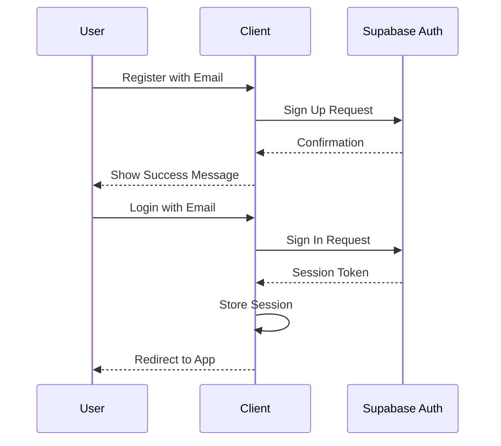
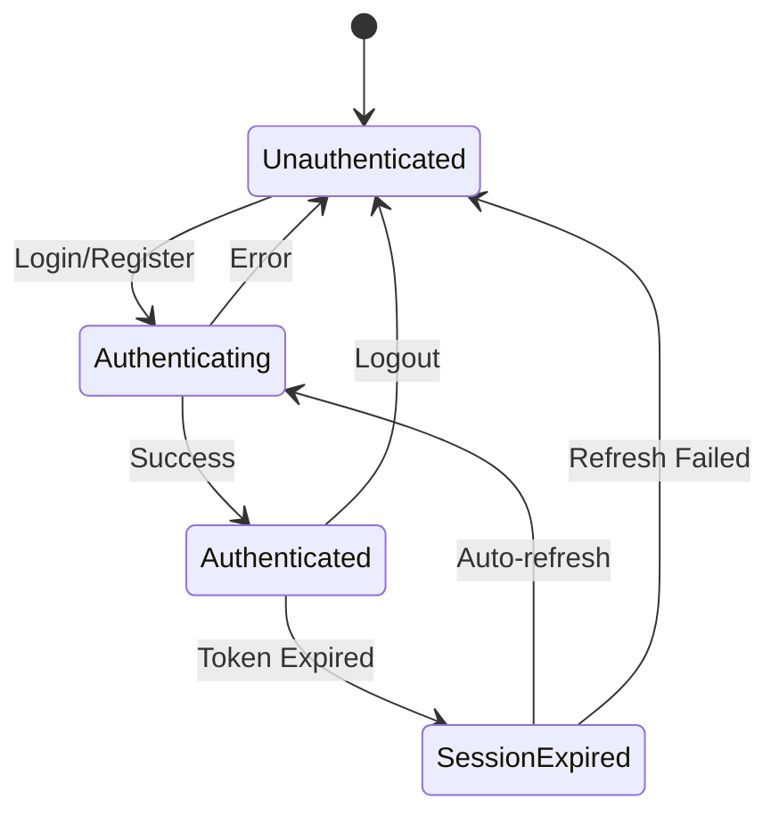

# Epic-1: User Authentication and Profile Setup

# Story-1: Implement user registration and login with email

## Story Description

**As a** new user
**I want** to register and log in using my email address and password
**so that** I can access my personal wardrobe in Kleiderzauber

## Status

Completed

## Context

This is the first story of the Epic-1, focusing on implementing basic authentication. The authentication will use Supabase Auth to handle user registration and login. This functionality is fundamental for the application as it provides the authenticated context necessary for all other features. The user interface will need to be responsive and provide appropriate feedback for various authentication states and errors.

## Estimation

Story Points: 3

## Tasks

1. - [x] Setup Supabase Authentication

   1. - [x] Configure Supabase auth settings
   2. - [x] Set up email templates
   3. - [x] Test auth configuration

2. - [x] Create Authentication Store

   1. - [x] Write tests for auth store
   2. - [x] Implement Zustand auth store
   3. - [x] Add auth state management
   4. - [x] Test auth state transitions

3. - [x] Implement Registration UI

   1. - [x] Write tests for registration component
   2. - [x] Create registration form component
   3. - [x] Implement form validation
   4. - [x] Add registration error handling
   5. - [x] Test registration flow

4. - [x] Implement Login UI

   1. - [x] Write tests for login component
   2. - [x] Create login form component
   3. - [x] Implement form validation
   4. - [x] Add login error handling
   5. - [x] Test login flow

5. - [x] Create Protected Routes

   1. - [x] Write tests for route protection
   2. - [x] Implement auth route guard component
   3. - [x] Set up public and protected routes
   4. - [x] Test route protection

6. - [x] Implement Session Management
   1. - [x] Write tests for session management
   2. - [x] Add session persistence
   3. - [x] Implement auto-login
   4. - [x] Add logout functionality
   5. - [x] Test session flows

## Constraints

- Must use Supabase Auth
- Must implement proper form validation
- Must handle and display user-friendly error messages
- Must provide secure session management
- Must work across all device sizes

## Data Models / Schema

### User Model

```typescript
interface User {
  id: string;
  email: string;
  created_at: string;
  last_sign_in_at?: string;
}
```

### Auth Store State

```typescript
interface AuthState {
  user: User | null;
  session: Session | null;
  isLoading: boolean;
  error: string | null;
  login: (email: string, password: string) => Promise<void>;
  register: (email: string, password: string) => Promise<void>;
  logout: () => Promise<void>;
  resetPassword: (email: string) => Promise<void>;
}
```

## Structure

```
/src
├── /components
│   ├── /auth
│   │   ├── /LoginForm
│   │   │   ├── LoginForm.tsx
│   │   │   ├── LoginForm.test.tsx
│   │   │   └── index.ts
│   │   ├── /RegisterForm
│   │   │   ├── RegisterForm.tsx
│   │   │   ├── RegisterForm.test.tsx
│   │   │   └── index.ts
│   │   ├── /ProtectedRoute
│   │   │   ├── ProtectedRoute.tsx
│   │   │   ├── ProtectedRoute.test.tsx
│   │   │   └── index.ts
│   │   └── index.ts
├── /pages
│   ├── LoginPage.tsx
│   └── RegisterPage.tsx
├── /stores
│   └── authStore.ts
└── /types
    └── auth.ts
```

## Diagrams





## Dev Notes

- We will use Supabase Auth UI components as a starting point but customize them to match our design
- Form validation will use client-side validation with helpful error messages
- Authentication errors from Supabase need to be translated to user-friendly messages
- Session token will be stored securely and refreshed automatically when possible
- All UI components should be responsive and accessible
