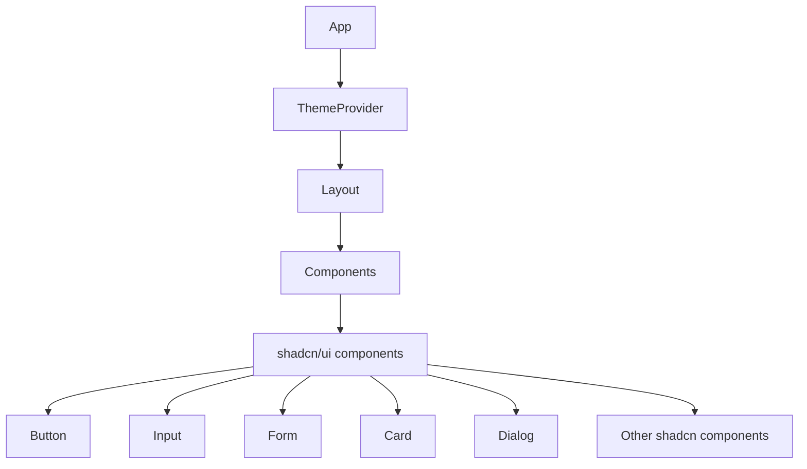
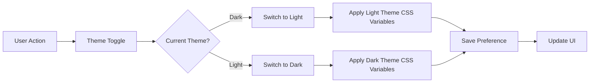

# Epic-2: UI Modernization and Component Library

# Story-2: Implement shadcn/ui component library

## Story Description

**As a** developer
**I want** to integrate the shadcn/ui component library into Kleiderzauber
**so that** I can efficiently build a consistent, accessible, and visually appealing user interface

## Status

In Progress - Shadcn/UI has been set up, components installed, and theme support implemented

## Context

This story focuses on implementing shadcn/ui, a modern UI component library built on Radix UI and Tailwind CSS. The implementation will enhance the application's UI consistency, improve accessibility, and provide reusable components that can be customized to match the Kleiderzauber design system. This will serve as the foundation for all future UI development in the application.

## Estimation

Story Points: 5

## Tasks

1. - [ ] Setup shadcn/ui in the project

   1. - [ ] Install required dependencies
   2. - [ ] Configure tailwind.config.js with shadcn presets
   3. - [ ] Set up the shadcn CLI tool
   4. - [ ] Create the global CSS variables for theming
   5. - [ ] Test the shadcn setup

2. - [ ] Create shadcn component configuration

   1. - [ ] Set up the components.json file
   2. - [ ] Configure the component directory structure
   3. - [ ] Configure styling preferences
   4. - [ ] Test the component generation

3. - [ ] Add core shadcn UI components

   1. - [ ] Add Button component
   2. - [ ] Add Input component
   3. - [ ] Add Form components (Form, FormField, FormItem, FormLabel, etc.)
   4. - [ ] Add Card components
   5. - [ ] Add Dialog components
   6. - [ ] Add Dropdown Menu components
   7. - [ ] Add Toast components
   8. - [ ] Test all core components

4. - [ ] Refactor existing forms with shadcn components

   1. - [ ] Refactor Login form
   2. - [ ] Refactor Registration form
   3. - [ ] Refactor Password Reset form
   4. - [ ] Test all refactored forms

5. - [ ] Implement theming and dark mode

   1. - [ ] Set up theme provider
   2. - [ ] Configure light and dark theme variables
   3. - [ ] Add theme toggle component
   4. - [ ] Implement theme persistence
   5. - [ ] Test theming system

6. - [ ] Create custom component variants
   1. - [ ] Define variant styles in tailwind.config.js
   2. - [ ] Create Kleiderzauber-specific button variants
   3. - [ ] Create Kleiderzauber-specific input variants
   4. - [ ] Document custom component variants
   5. - [ ] Test custom variants

## Constraints

- Must maintain accessibility standards (WCAG 2.1 AA)
- Must ensure responsive design across all screen sizes
- Must not break existing functionality
- Must follow shadcn/ui best practices for component customization
- Must maintain consistent spacing and typography across the application

## Data Models / Schema

No new data models are required for this story.

## Structure

```
/src
├── /components
│   ├── /ui               # shadcn/ui components
│   │   ├── /button
│   │   ├── /input
│   │   ├── /form
│   │   ├── /card
│   │   ├── /dialog
│   │   ├── /dropdown-menu
│   │   ├── /toast
│   │   └── ... other shadcn components
│   ├── /theme            # Theme-related components
│   │   ├── theme-provider.tsx
│   │   └── theme-toggle.tsx
├── /styles
│   └── globals.css       # Updated with shadcn variables
└── /lib
    └── utils.ts          # shadcn utility functions
```

## Diagrams





## Dev Notes

- shadcn/ui components are not a library but a collection of reusable components built on Radix UI primitives
- Components should be added via the shadcn CLI: `npx shadcn-ui@latest add [component-name]`
- Each component can be customized directly in the source code
- We will use CSS variables for theming to enable easy dark mode implementation
- Component variants should be defined in the `tailwind.config.js` file for consistent styling
- Form validation logic will be preserved during the refactoring process
- Consider using shadcn's Form component with react-hook-form for better form handling
