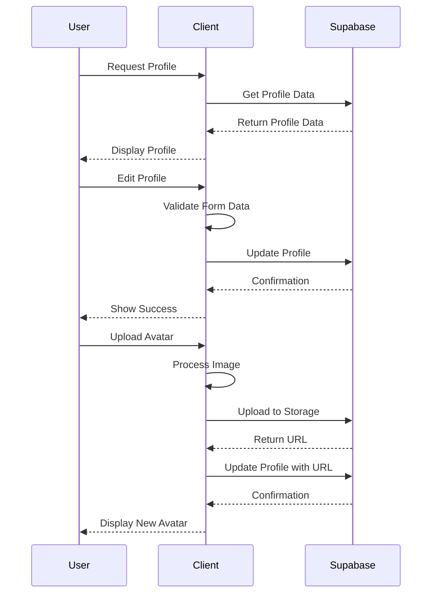
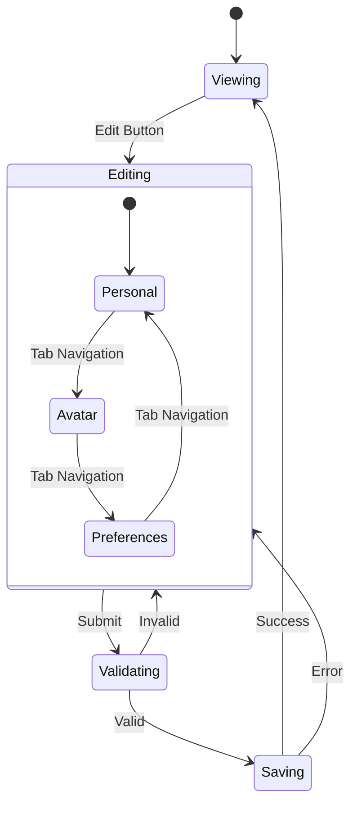

# Epic-1: User Authentication and Profile Setup

# Story-3: Implement User Profile Management

## Story Description

**As a** registered user
**I want** to be able to view and edit my profile information
**so that** I can manage my personal details and preferences for the Kleiderzauber platform

## Status

Not Started

## Context

This story builds upon the authentication functionality implemented in Story-1 and the UI components from Story-2. It focuses on creating a comprehensive user profile management system that allows users to view and edit their personal information, upload profile pictures, and set preferences. The profile management system will utilize Supabase's storage for avatar uploads and database for storing user information with proper row-level security policies.

## Estimation

Story Points: 5

## Tasks

1. - [ ] Set up Supabase database schema for profiles

   1. - [ ] Create profiles table with proper RLS policies
   2. - [ ] Set up storage bucket for avatar images
   3. - [ ] Create database triggers for new user profiles
   4. - [ ] Test database setup and security

2. - [ ] Create Profile Store

   1. - [ ] Write tests for profile store
   2. - [ ] Implement Zustand profile store
   3. - [ ] Add profile state management
   4. - [ ] Test profile state transitions

3. - [ ] Implement Profile View UI

   1. - [ ] Create profile information display component
   2. - [ ] Implement avatar display
   3. - [ ] Add profile navigation and layout
   4. - [ ] Test profile viewing functionality

4. - [ ] Implement Profile Edit UI

   1. - [ ] Create profile edit form component
   2. - [ ] Implement form validation with shadcn/ui components
   3. - [ ] Add profile update error handling
   4. - [ ] Test profile editing functionality

5. - [ ] Implement Avatar Management

   1. - [ ] Create avatar upload component
   2. - [ ] Implement image cropping and resizing
   3. - [ ] Add avatar update functionality
   4. - [ ] Test avatar management

6. - [ ] Create User Preferences Section
   1. - [ ] Define user preference options
   2. - [ ] Create preferences UI components
   3. - [ ] Implement preference saving functionality
   4. - [ ] Test user preferences

## Constraints

- Must use Supabase storage for avatar images
- Must implement proper RLS policies for profile data
- Must handle and optimize image uploads
- Must provide clear feedback during profile updates
- Must work across all device sizes
- Must support both light and dark themes

## Data Models / Schema

### Profile Model

```typescript
interface Profile {
  id: string; // Same as auth.user.id
  username: string | null;
  full_name: string | null;
  avatar_url: string | null;
  website: string | null;
  bio: string | null;
  updated_at: string | null;
}
```

### Database Schema

```sql
-- Create a table for public profiles
create table profiles (
  id uuid references auth.users not null primary key,
  updated_at timestamp with time zone,
  username text unique,
  full_name text,
  avatar_url text,
  website text,
  bio text,

  constraint username_length check (char_length(username) >= 3)
);

-- Set up Row Level Security (RLS)
alter table profiles
  enable row level security;

create policy "Public profiles are viewable by everyone." on profiles
  for select using (true);

create policy "Users can insert their own profile." on profiles
  for insert with check ((auth.uid()) = id);

create policy "Users can update own profile." on profiles
  for update using ((auth.uid()) = id);

-- Set up Storage
insert into storage.buckets (id, name)
  values ('avatars', 'avatars');

-- Set up access controls for storage
create policy "Avatar images are publicly accessible." on storage.objects
  for select using (bucket_id = 'avatars');

create policy "Anyone can upload an avatar." on storage.objects
  for insert with check (bucket_id = 'avatars');

create policy "Anyone can update their own avatar." on storage.objects
  for update using (auth.uid() = owner) with check (bucket_id = 'avatars');
```

### Profile Store State

```typescript
interface ProfileState {
  profile: Profile | null;
  isLoading: boolean;
  error: string | null;
  getProfile: (userId: string) => Promise<void>;
  updateProfile: (updates: Partial<Profile>) => Promise<void>;
  uploadAvatar: (file: File) => Promise<string>;
  setUsername: (username: string) => Promise<void>;
}
```

## Structure

```
/src
├── /components
│   ├── /profile
│   │   ├── /ProfileView
│   │   │   ├── ProfileView.tsx
│   │   │   ├── ProfileView.test.tsx
│   │   │   └── index.ts
│   │   ├── /ProfileEdit
│   │   │   ├── ProfileEdit.tsx
│   │   │   ├── ProfileEdit.test.tsx
│   │   │   └── index.ts
│   │   ├── /AvatarUpload
│   │   │   ├── AvatarUpload.tsx
│   │   │   ├── AvatarUpload.test.tsx
│   │   │   └── index.ts
│   │   ├── /UserPreferences
│   │   │   ├── UserPreferences.tsx
│   │   │   ├── UserPreferences.test.tsx
│   │   │   └── index.ts
│   │   └── index.ts
├── /pages
│   ├── ProfilePage.tsx
│   └── EditProfilePage.tsx
├── /stores
│   └── profileStore.ts
├── /services
│   └── avatarService.ts
└── /types
    └── profile.ts
```

## Diagrams





## Dev Notes

- Use shadcn/ui components for all forms and UI elements
- Implement optimistic updates for faster user feedback
- Use browser-image-compression for handling large avatar images
- Implement proper error handling and validation messages
- Ensure responsive design for all profile components
- Use custom shadcn/ui variants for consistent styling
- Consider implementing username validation to check availability in real-time

```

```
